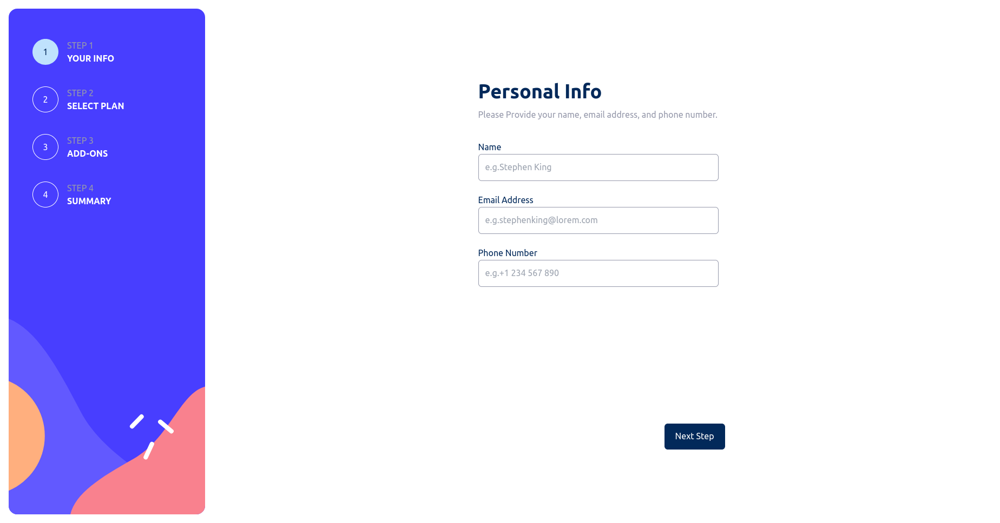
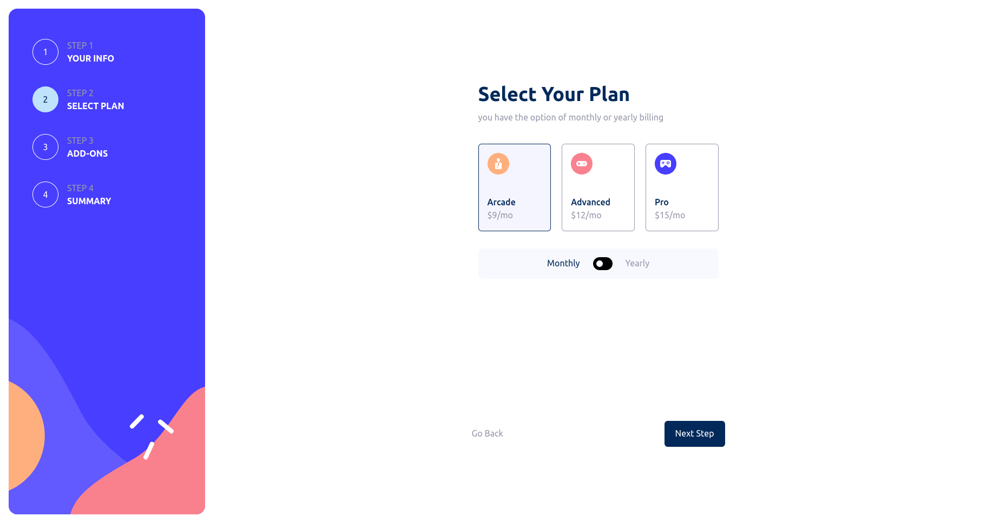
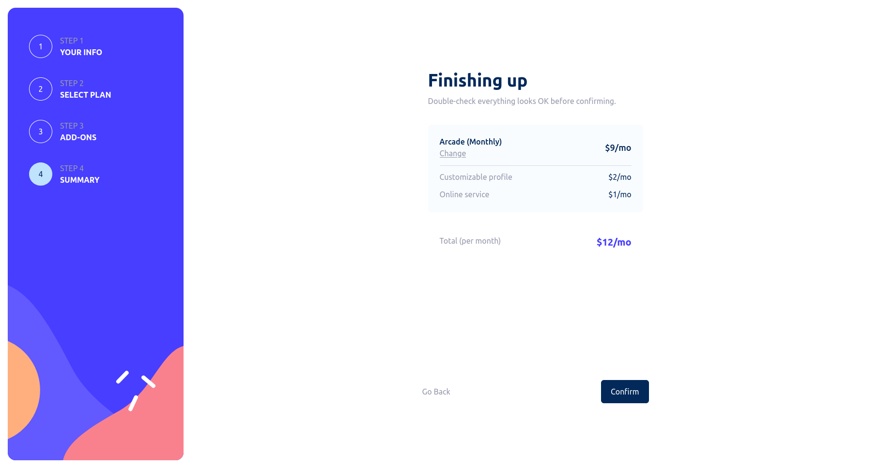
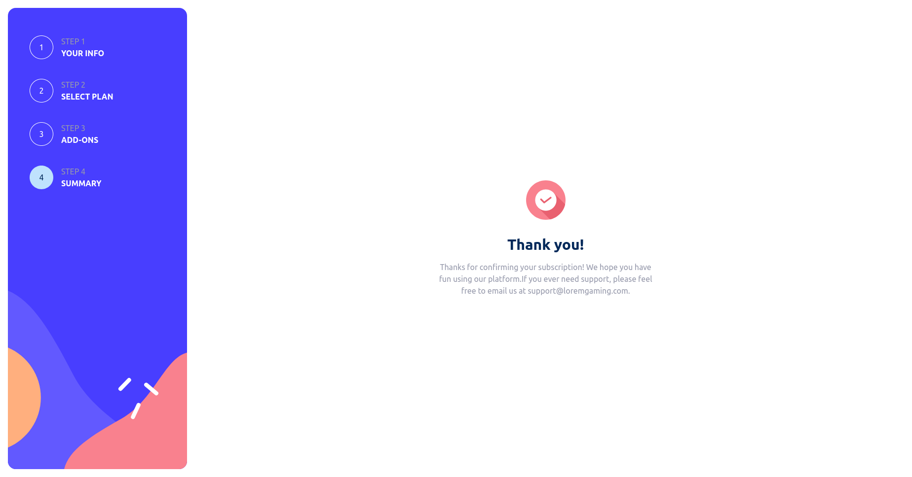
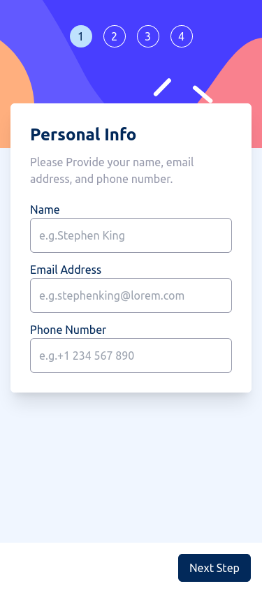
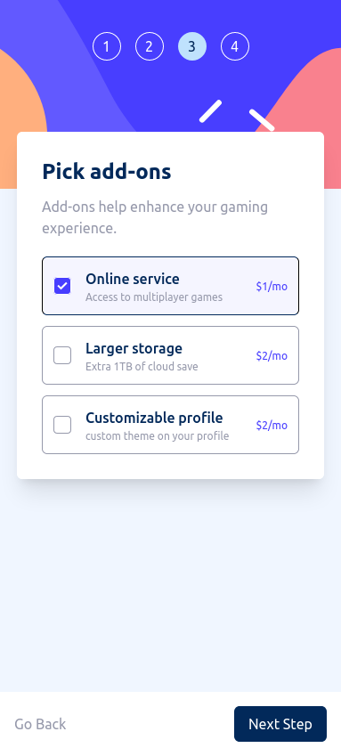
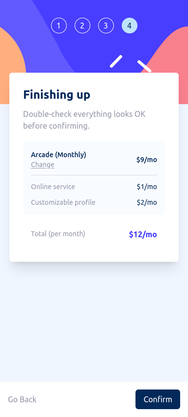
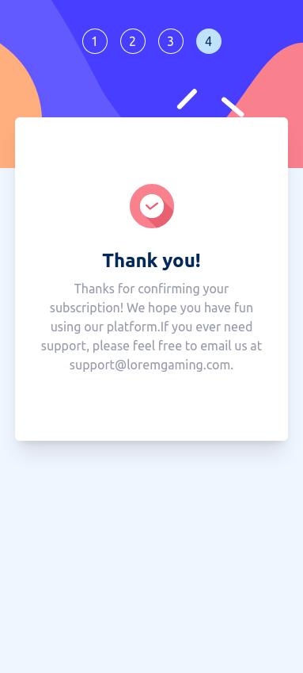

# Frontend Mentor - Multi-step form solution

This is a solution to the [Multi-step form challenge on Frontend Mentor](https://www.frontendmentor.io/challenges/multistep-form-YVAnSdqQBJ). Frontend Mentor challenges help you improve your coding skills by building realistic projects.

## Table of contents

- [Overview](#overview)
  - [The challenge](#the-challenge)
  - [Screenshot](#screenshot)
  - [Links](#links)
- [My process](#my-process)
  - [Built with](#built-with)
- [Author](#author)

## Overview

### The challenge

Users should be able to:

- Complete each step of the sequence
- See a summary of their selections on the final step and confirm their order
- View the optimal layout for the interface depending on their device's screen size
- See hover and focus states for all interactive elements on the page

### Screenshot

### Links

- Solution URL: [Add solution URL here](https://your-solution-url.com)
- Live Site URL: [Add live site URL here](https://your-live-site-url.com)

## My process

### Built with

- Semantic HTML5 markup
- Mobile-first workflow
- Flexbox
- CSS Grid
- [React](https://reactjs.org/) - JS library
- [Tailwind](https://tailwindcss.com/) - utility-first CSS framework
- [TypeScript](https://www.typescriptlang.org/)- strongly typed programming language that builds on JavaScript
- [Redux](https://redux.js.org/)- a predictable state container for JavaScript apps
- [ZOD](https://zod.dev/)- TypeScript-first schema validation with static type inference

## Author

- Frontend Mentor - [@Mirtineh](https://www.frontendmentor.io/profile/Mirtineh)
